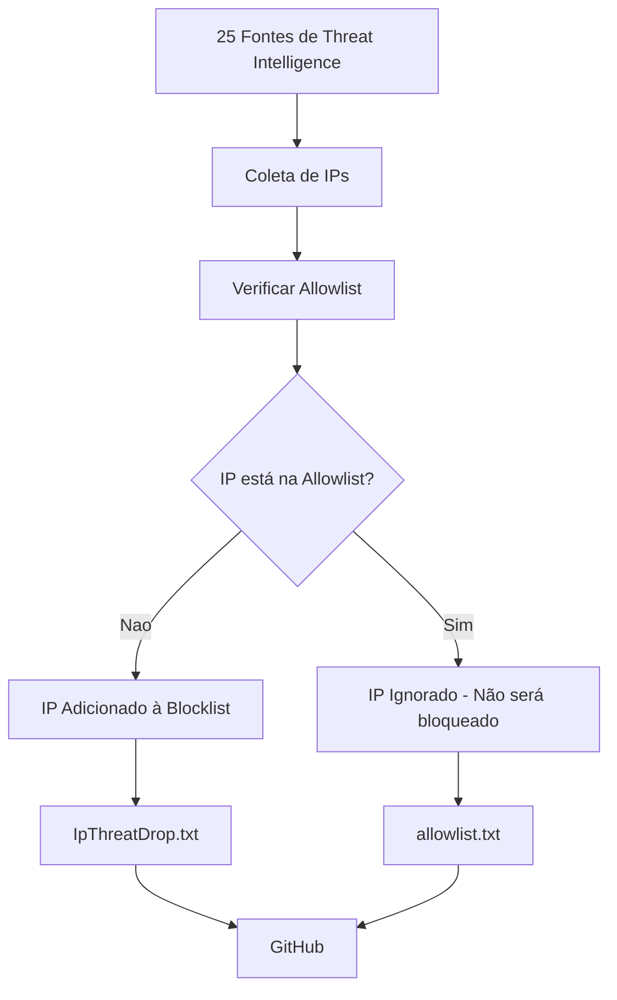

# 🛡️ IpThreatDrop - Blocklist Unificada

<p align="center">
  
  
  
  
</p>

## 📊 Estatísticas Atuais

<p align="center">
# Estatísticas Atuais

| Métrica | Valor |
|---------|-------|
| **📅 Última atualização** |  |
| **📊 Total coletado** |  |
| **🔄 Duplicados removidos** |  |
| **🌐 IPs únicos** |  |
| **📡 Sub-redes /24** |  |
| **🔗 Outras sub-redes** |  |
| **💻 IPs individuais** |  |
| **🗂️ Sub-redes agregadas** |  |
| **💾 Tamanho** |  |

</p>

## 📋 Descrição

**IpThreatDrop** é a **Blocklist Unificada** — uma lista de IPs e blocos CIDR maliciosos atualizada automaticamente a partir de **23 fontes** de threat intelligence (Spamhaus DROP, Emerging Threats, Abuse.ch, OTX AlienVault, SERPRO, ThreatFox, etc.).

## 🔒 O Que é a Allowlist?

A allowlist é um conjunto de IPs que **nunca serão bloqueados**, mesmo que apareçam nas fontes de threat intelligence. Isso garante que serviços essenciais (Google, AWS, Cloudflare, etc.) continuem funcionando sem interrupção.

### ✅ IPs que Nunca São Bloqueados (exemplos)
| Empresa          | Serviços                          | Importância                     |
|------------------|-----------------------------------|---------------------------------|
| Google           | GCP, Workspace, 8.8.8.8           | DNS, e-mail, pesquisas          |
| Amazon AWS       | EC2, S3, CloudFront               | Hospedagem em nuvem             |
| Microsoft Azure  | Azure, Office 365, Teams          | Serviços corporativos           |
| Cloudflare       | CDN, DNS, DDoS Protection         | Proteção de sites               |


### 🎯 Exemplo Prático

**Cenário**: O IP `8.8.8.8` (Google DNS) aparece em uma lista de IPs maliciosos.

- ❌ **Sem allowlist**: O IP seria bloqueado, e você perderia acesso ao DNS do Google
- ✅ **Com allowlist**: O IP é removido automaticamente da blocklist, mantendo seu DNS funcionando

### 🛡️ Como Funciona

1. **Coleta**: O script coleta IPs de 23 fontes diferentes
2. **Filtragem**: Antes de adicionar à blocklist, todos os IPs são verificados
3. **Allowlist**: Se um IP estiver na allowlist, ele é **automaticamente removido** da blocklist
4. **Resultado**: Você nunca bloqueia acidentalmente serviços como Google, AWS, Microsoft ou Cloudflare

## 📊 Fluxo de Processamento



## 📦 Lista Completa de Fontes (25)

### 🔵 OTX AlienVault (5 listas)
| # | Nome                              | ID do Pulse       |
|---|-----------------------------------|-------------------|
| 1 | HoneyAI_HTTP_Honeypot             | `69ebf361c06a57718d0c0838` |
| 2 | PurpleSynapz                      | `5de8ad9a8b95247cfa55def7` |
| 3 | HoneyAI_Network_Services_Attack_Feed | `6a3407d69c9a31c90e0debe2` |
| 4 | Federal_Agencies_Warn             | `6a6ab0b45dd9e2b4b1972bca` |
| 5 | DatasoftComnet-AntiSpam           | `62ed397d23b4894198f2816e` |

### 🟢 Listas Tradicionais (20)

#### Spamhaus & Emerging Threats
| #  | Nome                    | Descrição                          |
|----|-------------------------|------------------------------------|
| 6  | IpThreatDrop            | Blocos CIDR de redes maliciosas    |
| 7  | Emerging Threats        | IPs comprometidos                  |

#### Abuse.ch & Blocklist.de
| #  | Nome                          | Descrição                              |
|----|-------------------------------|----------------------------------------|
| 8  | Feodo Tracker                 | IPs de C&C e botnets                   |
| 9  | blocklist.de (all)            | Lista completa de atacantes            |
| 10 | blocklist.de (bruteforce)     | IPs com tentativas de força bruta      |

#### Score & Intelligence
| #  | Nome              | Descrição                          |
|----|-------------------|------------------------------------|
| 11 | CINS Score        | IPs com pontuação de risco         |
| 12 | public-xlogic     | IPs maliciosos                     |

#### DShield & Defense
| #  | Nome              | Descrição                          |
|----|-------------------|------------------------------------|
| 13 | DShield           | IPs reportados ao DShield          |
| 14 | Binary Defense    | Lista de banimento                 |

#### OpenDBL (5 listas)
| #  | Nome                              | Descrição                              |
|----|-----------------------------------|----------------------------------------|
| 15 | OpenDBL - blocklistde-all         | Lista completa                         |
| 16 | OpenDBL - bruteforce              | Tentativas de força bruta              |
| 17 | OpenDBL - tor-exit                | Nós de saída Tor                       |
| 18 | OpenDBL - etknown                 | IPs conhecidos                         |
| 19 | OpenDBL - ipsum                   | IPs maliciosos                         |

#### Threat Intel & Locais
| #  | Nome                        | Descrição                              |
|----|-----------------------------|----------------------------------------|
| 20 | Ziyadnz Threat Intel       | Feed de inteligência                   |
| 21 | Netlas                      | IPs maliciosos                         |

#### Governo & Abuse
| #  | Nome                          | Descrição                              |
|----|-------------------------------|----------------------------------------|
| 22 | SERPRO Blocklist             | Lista do SERPRO                        |
| 23 | ThreatFox (abuse.ch)         | IPs da ThreatFox                       |

#### GreenSnow
| #  | Nome          | URL                                              | Descrição                          |
|----|---------------|--------------------------------------------------|------------------------------------|
| 24 | GreenSnow     | `https://blocklist.greensnow.co/greensnow.txt`   | Lista de IPs maliciosos (ataques, bruteforce, etc.) |

#### SpydiSec
| #  | Nome          | URL                                              | Descrição                          |
|----|---------------|--------------------------------------------------|------------------------------------|
| 25 | SpydiSec      | `https://spydisec.com/maliciousips.txt`          | Blocklist IP completa (curated multi-source) |

### Categorias de Origem
Os IPs e CIDRs são marcados com a origem no arquivo:

- `OTX_*`: Fontes do AlienVault OTX  
- `spamhaus-drop`: IpThreatDrop  
- `emergingthreats`: Emerging Threats  
- `blocklist.de`: blocklist.de  
- `cins`: CINS Score  
- `dshield`: DShield  
- `opendbl-*`: OpenDBL  
- `threatfox`: ThreatFox (abuse.ch)  
- `bruteforceblocker`: BruteforceBlocker  
- `serpro`: SERPRO Blocklist  
- `netlas`: Netlas  
- `ziyadnz`: Ziyadnz Threat Intel  
- `greensnow`: GreenSnow  
- `spydisec`: SpydiSec  

## 🚀 Como Usar

**Em firewalls (Fortigate/pfSense/OPNsense)**

```
URL: https://raw.githubusercontent.com/marciosx/IpThreatDrop/main/IpThreatDrop.txt
```

**Em MikroTik RouterOS**

```
/tool fetch url="https://raw.githubusercontent.com/marciosx/IpThreatDrop/main/IpThreatDrop.txt" dst-path=blocklist.txt
/import file=blocklist.txt
```

**Em iptables**

```bash
curl -s https://raw.githubusercontent.com/marciosx/IpThreatDrop/main/IpThreatDrop.txt | \
    grep -E '^[0-9]' | \
    while read ip; do
        iptables -A INPUT -s $ip -j DROP
    done
```
**Em Python**

```python
import requests

url = "https://raw.githubusercontent.com/marciosx/IpThreatDrop/main/IpThreatDrop.txt"
response = requests.get(url)
ips = [line.split('#')[0].strip() for line in response.text.splitlines()
       if line and not line.startswith('#')]
```

**Em PowerShell**

```powershell
$url = "https://raw.githubusercontent.com/marciosx/IpThreatDrop/main/IpThreatDrop.txt"
$ips = Invoke-WebRequest -Uri $url |
    Select-Object -ExpandProperty Content |
    Where-Object { $_ -notmatch '^#' -and $_ -match '^[0-9]' }
```

### 🔄 Frequência de Atualização

Automática: a cada 12 horas via CRON.

### 📝 Formato do Arquivo

```
<IP ou CIDR> # <origem> [informações adicionais]

IPs individuais (não agregados)
66.132.172.5 # binarydefense
66.132.172.100 # threatfox
66.132.172.200 # serpro,blocklist.de

Sub-redes agregadas com máscaras dinâmicas
66.132.186.0/24 # subnet-agregado(188_IPs) binarydefense,cins,...
66.132.195.0/26 # subnet-agregado(45_IPs) opendbl-blocklistde,serpro,...
66.132.200.0/30 # subnet-agregado(4_IPs) threatfox,ziyadnz,...
66.132.210.32/29 # subnet-agregado(6_IPs) OTX_HoneyAI_Network_Services_Attack_Feed,...
```

### 🔧 Como os Dados São Coletados

Os dados são gerados automaticamente por um script PowerShell que unifica todas as 24 fontes.

**Script:** Blocklist Unifier

[](https://opensource.org/licenses/MIT)
[](https://microsoft.com/powershell)
[](CHANGELOG.md)


### ✨ Características do Script

- 🔒 25 fontes de threat intelligence ativas
- 🚀 Coleta paralela com timeout e retry automático
- 🧹 Deduplicação inteligente com agregação de sub-redes /24, /25, /26, /27, /28, /29,/30
- 📊 Logs rotativos (manhã/tarde) com retenção de 1 dia
- 🛡️ Suporte OTX AlienVault via API oficial (com paginação)
- 📝 Histórico dos últimos 3 dias
### ⚠️ Aviso

Esta lista é fornecida "como está", sem garantias de qualquer tipo. Recomenda-se:

- ✅ Testar antes de usar em produção
- ✅ Manter backups regulares
- ✅ Verificar periodicamente a precisão dos dados
- ✅ Monitorar falsos positivos
- ✅ Ter um plano de contingência

O uso desta lista é de inteira responsabilidade do usuário.

### 📜 Licença

Este conjunto de dados é fornecido sob a licença MIT. As fontes originais podem ter suas próprias licenças.

MIT License - Copyright (c) 2026 marciosx

## 📧 Contato

- Issues: GitHub Issues
- Email: marciosx@gmail.com

## 🎯 Download


### Arquivo completo
```bash
# Allowlist (serviços críticos)
wget https://raw.githubusercontent.com/marciosx/IpThreatDrop/main/allowlist.txt

# Blocklist completa (última versão)
wget https://raw.githubusercontent.com/marciosx/IpThreatDrop/main/IpThreatDrop.txt
curl -O https://raw.githubusercontent.com/marciosx/IpThreatDrop/main/IpThreatDrop.txt

```
